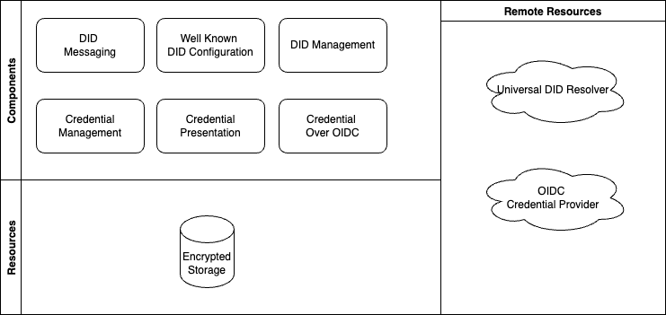

MATTR Wallet SDK React Native / [Exports](modules.md)

# wallet-sdk-react-native

# Table of Contents

- [Features](#features)
- [Getting started](#getting-started)
- [Usage](#usage)
  - [Codec](#codec)
  - [Wallet](#wallet)
  - [Retrieving credentials via OIDC Bridge](#retrieving-credentials-via-oidc-bridge)
  - [Retrieving credentials via OpenID4VCI (Tech Preview)](#retrieving-credentials-via-openid4vci-tech-preview)
  - [Handling a credential presentation request via DIDComm message](#handling-a-credential-presentation-request-via-didcomm-message)
  - [Error handling](#error-handling)

# Features

- Codec operations
- Manage DIDs
- Filter, derive and verify credentials
- Discover, request and retrieve credentials from oidc providers
- Validate a DID to domain linkage with wellKnownDidConfiguration
- Create and send presentation request responses
- DIDComm messaging

# High level overview



# Getting started

## How to get access to MATTR Pi Wallet SDK
To gain access to the MATTR Pi Wallet SDK, please follow these steps. These steps are necessary to acquire access to the SDK before it can be used:

1. Request or download the ["Terms of Agreement"](Licence.pdf).
2. Read the "Terms of agreement", sign it, and return it to us. 
3. Create an Account at [NPMJS - Node Package Manager for JavaScript](https://www.npmjs.com).
4. Ensure multi-factor authentication (MFA) is Configured on NPMJS Account.
5. Create a Personal Access token: [Create a personal access token](https://docs.npmjs.com/creating-and-viewing-access-tokenshttps://docs.npmjs.com/creating-and-viewing-access-tokens).
6. Supply the NPMJS (Node Package Manager for Java Script) Account Name back to MATTR.
7. MATTR will process the request and allow you to access the Wallet SDK if all the information is complete. 

> Please reach out to us in case you need any assistance. [Get in touch](https://mattr.global/contact)


## Install dependencies

Add this SDK as a dependency to the react native app:

```
yarn add @mattrglobal/wallet-sdk-react-native
```

The SDK relies on a set of peer dependencies that contain native libraries and iOS pods. With React Native >=0.60 these
dependencies will be autolinked.

Install the peer dependencies:

```
yarn add react-native-securerandom@1.0.1 realm@11.3.1 react-native-fs@2.17.0 react-native-secure-key-store@2.0.10 @mattrglobal/rn-bbs-signatures@1.0.0 react-native-get-random-values@1.7.0

Note: we tested with react-native 0.68.5 and 0.70.6
```

**React Native <0.60**

Please see the specific instructions for each dependency regarding linking prior to React Native 0.60.

## Android only

Make sure the following repository is included under `android/build.gradle` `allprojects.repositories`:

```
allprojects {
    repositories {
        ...
        maven { url 'https://oss.sonatype.org/content/repositories/snapshots/' }
        ...
    }
}
```

## iOS only

Add the pod for bbs-signatures to the podfile in `ios/Podfile`:

```
  pod 'bbs-signatures', :git => 'https://github.com/mattrglobal/ffi-bbs-signatures'
```

Run pod install:

```
cd ios && pod install
```

# Usage

## Codec

```typescript
import { codec } from "@mattrglobal/wallet-sdk-react-native";

const bytes = codec.stringToBytes("a string");
```

## Wallet

Create a new wallet:

```typescript
import { create } from "@mattrglobal/wallet-sdk-react-native";

const createWalletResult = await create();

if (createWalletResult.isErr()) {
  // Handle error from createWalletResult.error
  return;
}
```

Open an existing wallet:

```typescript
import { open } from "@mattrglobal/wallet-sdk-react-native";

const openWalletResult = await open();

if (openWalletResult.isErr()) {
  // Handle error from openWalletResult.error
  return;
}

const wallet = openWalletResult.value;
```

Use the open wallet:

```typescript
// Create a new DID
const createDidResult = await wallet.did.create();

if (createDidResult.isErr()) {
  // Handle error from createDidResult.error
  return;
}

const { did } = createDidResult.value;
```

Close the wallet:

```typescript
import { close } from "@mattrglobal/wallet-sdk-react-native";

console.log(wallet.isOpen()); // true

const closeWalletResult = await wallet.close();

if (closeWalletResult.isErr()) {
  // Handle error from closeWalletResult.error
  return;
}

console.log(wallet.isOpen()); // false
```

Destroy the wallet:

```typescript
import { destroy } from "@mattrglobal/wallet-sdk-react-native";

await wallet.destroy();
```

## Retrieving credentials via OIDC Bridge

Discover OIDC credential offer

```typescript
const discoverResult = await wallet.oidc.discover("openid://discovery?issuer=https://issuer.example.com");

if (discoverResult.isErr()) {
  // Handle error from discoverResult.error
  return;
}

const { offer } = discoverResult.value;
```

Create a local subject DID for the credential

```typescript
const createDidResult = await wallet.did.create();

if (createDidResult.isErr()) {
  // Handle error from createDidResult.error
  return;
}

const { did } = createDidResult.value;
```

Generate an OpenID authorization url to request the credential

```typescript
import { Linking } from "react-native";

const genUrlResult = await wallet.oidc.generateAuthorizeUrl({ offer, did });

if (genUrlResult.isErr()) {
  // Handle error from genUrlResult.error
  return;
}

const { url, codeVerifier, nonce } = genUrlResult.value;
await Linking.openURL(url);
```

Retrieve the credential on authorization success callback

```typescript
const retrieveResult = (retrieveCredential = await wallet.oidc.retrieveCredential({
  offer,
  codeVerifier,
  nonce,
  code: route.params.code, // code comes from part of the callback url
}));

if (retrieveResult.isErr()) {
  // Handle error from retrieveResult.error
  return;
}

const { credential } = retrieveResult.value;
```

Verify a credential

```typescript
const verifyResult = await wallet.credential.verify({ credential });

if (verifyResult.isErr()) {
  // Handle error from verifyResult.error
  return;
}

const { credentialVerified, status } = verifyResult.value;
```

## Retrieving credentials via OpenID4VCI (Tech Preview)

Discover credential offer details via offer URI

```typescript
/***
 * openid-credential-offer://?credential_offer=encodeURIComponent(JSON.stringify({ credential_issuer, credentials: [{credentialId}], request_parameters? }))
 */
const uri =
  "openid-credential-offer://?credential_offer=%7B%22credential_issuer%22%3A%22https%3A%2F%2Fmyissuer.example.com%22%2C%22credentials%22%3A%5B%22707e920a-f342-443b-ae24-6946b7b5033e%22%5D%2C%22request_parameters%22%3A%7B%22login_hint%22%3A%22ken.huang%40mattr.global%22%2C%22prompt%22%3A%22login%22%7D%7D";

const offer = unwrap(await wallet.openid.issuance.discover(uri));
```

Or construct offer manually

```typescript
const offer: OpenidIssuanceCredentialOffer = {
  issuer: "https://example.com/",
  authorizeEndpoint: "https://example.com/oauth/authorize",
  tokenEndpoint: "https://example.com/oauth/token",
  credentialEndpoint: "https://example.com/oauth/credential",
  credentials: [
    {
      format: "ldp_vc",
      scope: "UniversityDegreeCredential",
      type: "UniversityDegreeCredential",
    },
  ],
};
```

Configure OAuth client id and redirect uri

```typescript
const clientId = "myAppClientId";
const redirectUri = "myapp://credentials/callback";
```

Generate an authorization url and open in a web browser

```typescript
import { Linking } from "react-native";

const generateAuthorizeUrlResult = await wallet.openid.issuance.generateAuthorizeUrl({ offer, clientId, redirectUri });

if (generateAuthorizeUrlResult.isErr()) {
  // Handle error from generateAuthorizeUrlResult.error
  return;
}

const { url, codeVerifier } = generateAuthorizeUrlResult.value;
await Linking.openURL(url);
```

Handle authorization success callback

```typescript
myapp://credentials/callback?code=...&iss=...
```

Retrieve token

```typescript
const retrieveTokenResult = await wallet.openid.issuance.retrieveToken({
  offer,
  clientId,
  redirectUri,
  codeVerifier,
  code: route.params.code, // code comes authorization success callback above
});

if (retrieveTokenResult.isErr()) {
  // Handle error from retrieveTokenResult.error
  return;
}

const { accessToken } = retrieveTokenResult.value;
```

Retrieve credentials

```typescript
const retrieveCredentialsResult = await wallet.openid.issuance.retrieveCredentials({
  offer,
  accessToken,
  clientId,
});

if (retrieveCredentialsResult.isErr()) {
  // Handle error from retrieveCredentialsResult.error
  return;
}

retrieveCredentialsResult.value.credentials.forEach(({ credential, format, did }) => {
  // present to user and/or store
});
```

## Handling a credential presentation request via DIDComm message

Open a presentation request DIDComm message

```typescript
import { isPresentationRequestJwm } from "wallet-sdk-react-native";
const openResult = await wallet.messaging.openDidCommMessage(message);

if (openResult.isErr() || !isPresentationRequestJwm(openResult.value)) {
  return;
}

const presentationRequest = openResult.value;
```

Look up for matching credentials

```typescript
const credentialData = [
  { id: "a", credential: credentailA },
  { id: "b", credential: credentailB },
];

const filterResult = await wallet.presentation.filterCredentialsByQuery({
  credentials: credentialData,
  // Note that only the presentation request body should contain single query only, under the same query could contain multiple sub queries.
  query: presentationRequest.body.query[0],
});
```

Create and send presentation

```typescript
const createPresentationResult = await wallet.presentation.create({
  challenge: presentationRequest.body.challenge,
  domain: presentationRequest.body.domain,
  credentials,
  holder: did,
});

if (createPresentationResult.isErr()) {
  // Handle error from createPresentationResult.error
  return;
}

const presentaiton = createPresentationResult.value;
const sendPresentationResult = await wallet.presentation.sendPresentationResponse({
  presentationRequest,
  presentation,
});
```

## Error handling

Functions that are expected to have an error path return a
[Neverthrow Result](https://www.npmjs.com/package/neverthrow#synchronous-api-result) type that represents either success
(`Ok`) or failure (`Err`).

Although this pattern is more verbose, it encourages the handling of possibly errors and reserves throwing exceptions
for truly exceptional situations.

```typescript
import { open } from "@mattrglobal/wallet-sdk-react-native";

const openWalletResult = await open();

if (openWalletResult.isErr()) {
  // Handle error from openWalletResult.error
  return;
}

const wallet = openWalletResult.value;
```

### unwrap

A utility function is provided for convenience if you decide not to handle your errors as results. This function will
simply throw an error if the function passed in returns a `Result` where `Resut.isErr()` is true.

```typescript
import { unwrap } from "@mattrglobal/wallet-sdk-react-native";

try {
  const wallet = unwrap(await open());
} catch (error) {
  // Handle thrown error
}
```

## Licensing

see [here](Licence.pdf) for licence information
